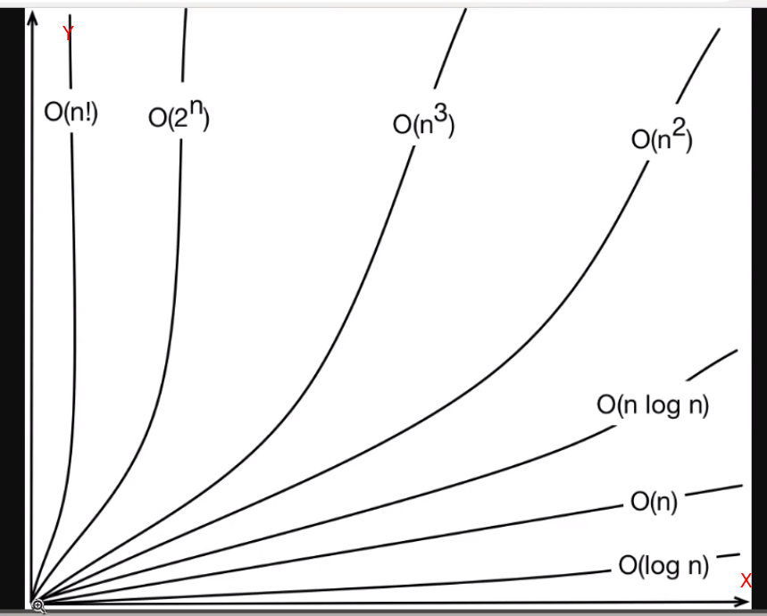
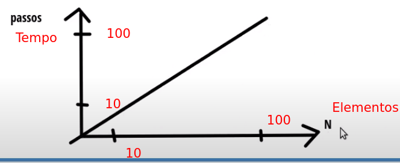
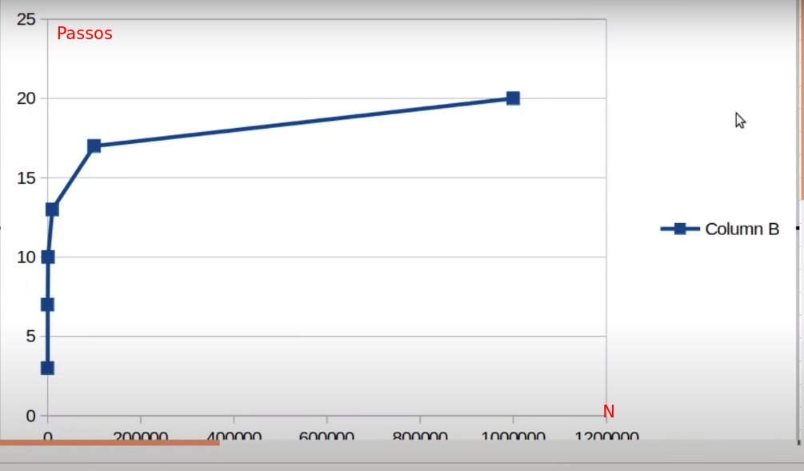

**LinkedList**
* cada elemento sabe só quem é seu próximo,
com isso ganhamos algumas facilidade e conseguimos fazer operações mais rápidas,
como adicionar um novo elemento no final da lista e falamos para o elemento que era o último
que agora ele tem um próximo elemento, por isso é uma listada ligada,
cada elemento esta ligado ao próximo elemento,
se eu remover um elemento do meio eu vou ligar o elemento que estava antes do que foi removido
no próximo elemento, ela tem uma tamanho dinamico.
mas ela tem um problema, para encontrar um elemento 
precisa percorer toda a lista, com vetor além de 
busca linear podemos usar a busca binaria 
(vamos aprender no futuro)

**Complexidade de algoritimos**
 
 

* Espaço (Memória e Disco)
* Processamento (caso que irei forcar primeiro)

[10, 9, 3, 2, 4, 7, 5, 8]
 
* Melhor caso (primeiro): 10
* Caso Médio (o meio do vetor +-): 2
* Pior caso (último): 8

Notação para representar: O
 

ou Notação Big O
 

O(alguma coisa)

Eixo X é o tamanho do Vetor
 
Eixo Y é o tempo para executar o Vetor

Linear search é representado por **O(n)**
 
**n** = tamanho do vetor
**O** = A letra "O" é usada para denotar a ordem de crescimento do algoritmo (o tempo).
 
o melhor algoritimo é o **O(log n)**

Exemplo de linear search:

10 elementos = 10 passos (tempo)
 
100 elementos = 100 passos (tempo)
 
Complexidade é **O(n)**

Exemplo de busca binaria:
 
[0, 2, 4, 6, 8, 10, 12, 14]
 
Busca binaria é mais rápida que a busca linear
mas para ela ser mais rápida, o vetor precisa estar ordenado
se não ela não funciona.
ele sempre pega inicio e fim e calcula o meio,
se o número que caiu é menor do qual você procura,
ele faz isso de novo partido do próximo número (se era 6 vai para 8)

é uma curva logaritima, o número de elemento vai para um milhão
mas os passos não cresce igual

Complexidade é **O(log n)** é quase a melhor 
(sendo a melhor que o algoritimo só busca 1x, impossível)
pois não cresce igual.
